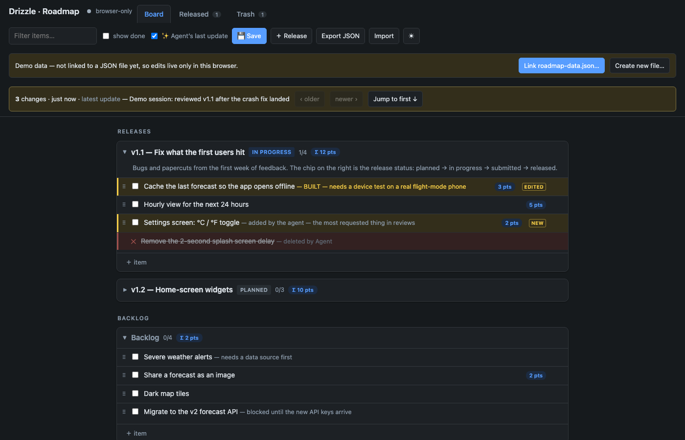

# Agent Roadmap

**A quick-and-dirty release roadmap that you and your AI coding agent edit together.**

One HTML file. One Python script. One JSON file on disk. No build, no server, no accounts, no dependencies.

You plan in the browser. Your agent (Claude Code, Codex, Cursor, Copilot, Aider, anything that can run a script) plans from the terminal. Both write the same file, and the page **rings exactly what the agent changed** in its last session so you never have to diff a markdown TODO again.

[](https://mikelux1.github.io/agent-roadmap/)
[](https://github.com/mikelux1/agent-roadmap/releases/latest)
[](LICENSE)
[](https://github.com/mikelux1/agent-roadmap/stargazers)



> **Try it now:** [mikelux1.github.io/agent-roadmap](https://mikelux1.github.io/agent-roadmap/) opens a demo project with dummy entries that explain every feature. Turn on **✨ last update** in the header to see what a demo agent session touched.

## Why this exists

Working with a coding agent, the plan is the product. But the plan keeps living in the wrong places: a `TODO.md` the agent rewrites until you can't see what moved, a chat transcript that evaporates when the context window fills, or a Jira board the agent can't touch.

This tool is the smallest thing that fixes that:

- **One shared file.** `roadmap-data.json` sits in your repo next to the code. You edit it through `roadmap.html`; the agent edits it through `roadmap.py`. Both sides merge, neither side clobbers.
- **You can see what the agent did.** Every node the agent touches is stamped. Flip a toggle and the page rings each item it added, edited, moved or deleted in its most recent session, with a button to walk back through earlier sessions.
- **Your edits win.** If you both change the same field before the file syncs, the page keeps yours and lists the agent's version in a banner. Nothing is silently lost.
- **The agent gets memory across sessions.** `roadmap.py status` and `roadmap.py changes --by human` tell a fresh agent session what happened while it was gone.

It is deliberately quick and dirty. It is not Jira, Linear or a Gantt chart. It is a board with releases, a backlog, effort points, notes and a trash can, and it fits in a file you can read.

## Quick start

1. **Download two files** from the [latest release](https://github.com/mikelux1/agent-roadmap/releases/latest): `roadmap.html` and `roadmap.py`. Put them in your project (a `planning/` folder is a good spot).
2. **Create the data file.** Either run

   ```bash
   python3 roadmap.py init --project "My app" --agent Claude
   ```

   or just open `roadmap.html` in Chrome and press **💾 Save** to create one from the demo.
3. **Open `roadmap.html` in Chrome** (double-click the file) and use the banner to **Link `roadmap-data.json`**. The dot next to the title turns green: the page now autosaves to that file and watches it for changes every two seconds.
4. **Tell your agent about it.** Paste [`agent-instructions.md`](agent-instructions.md) into your `CLAUDE.md`, `AGENTS.md`, `.cursorrules` or whatever your agent reads. That's it.

Python 3.8+ and Chrome (or another Chromium browser: Edge, Brave, Arc) are the only requirements. Firefox and Safari run the page too, but without live file sync; they fall back to browser storage plus Export/Import.

## What you get

**In the browser**

- Releases with a status chip (planned → in progress → submitted → released) and a one-line subtitle
- Items with a title, a short note, effort points, and HTML details in a side panel
- Drag-and-drop between releases and the backlog, checkboxes for done, per-release point totals
- A Released tab for shipped work, a Trash tab with restore, free-form notes, search, dark mode
- Autosave to the linked JSON file plus browser storage as a backup, and Export/Import at any time
- **✨ last update**: rings everything the agent changed in its latest session, with ‹ older / newer › to step through history
- A conflict banner when your edit overrode the agent's

**From the terminal (`roadmap.py`)**

```
init [--project NAME] [--agent NAME] [--demo]   create a fresh roadmap-data.json
status                     what's in the file, who touched it last
ls [--section S] [--grep T] [--todo|--done] [--by human|agent]
show <id>
sections
changes [--by human] [--since last|ISO|12h] [--mark]
seen                       mark everything up to now as read
begin [note] / end         group the next writes into one update session
set <id> [--title T] [--note N] [--detail H] [--done|--undone] [--pts N|--no-pts] [--section S]
add --section S --title T [--note N] [--detail H] [--pts N] [--after ID]
rm <id>
rel-set <id> [--title T] [--status S] [--sub S]
rel-add --title T [--status S] [--sub S]
note-add --title T --html H
note-set <id> [--title T] [--html H]
```

A typical agent session looks like this:

```bash
python3 roadmap.py status                      # anything new from the human?
python3 roadmap.py changes --by human --mark   # read their edits, move the watermark
python3 roadmap.py begin "Sprint review after the crash fix"
python3 roadmap.py set v11-crash --done --note "DONE — shipped in build 12"
python3 roadmap.py add --section v1-1 --title "Settings screen: °C / °F toggle" --pts 2
python3 roadmap.py rm v11-splash
python3 roadmap.py end
```

Every write is atomic and checked against the file's modification time, so the script never lands on top of a browser save it didn't see. Use `--file path/to/roadmap-data.json` or `ROADMAP_FILE=...` if the data file isn't next to the script.

## How the sync works

- The page keeps three copies in memory: the last file content both sides agreed on (base), what you have (mine), and what is on disk (theirs).
- Every two seconds, and whenever the tab regains focus, it re-reads the file. If it changed, it runs a field-level three-way merge: fields only the disk changed are taken, fields only you changed are kept, fields you both changed become a conflict where yours wins and theirs is listed in the banner.
- Ordering is merged per section: your order sticks only if you actually reordered; otherwise the disk order is adopted.
- Deletions on disk are honoured unless you edited the node since. Trash is unioned.
- The merged result is written straight back, so both sides converge.
- The agent log (`agentLog` in the JSON) is owned by the script: each `begin`…`end` session is one entry with the list of changes, capped at the last 12 sessions.

## Data format

`roadmap-data.json` is plain, readable JSON (`schema: 3`):

```jsonc
{
  "schema": 3,
  "project": "Drizzle",          // shown in the page header
  "agent": "Claude",             // what the UI calls the agent
  "releases": [
    { "id": "v1-1", "title": "v1.1 — Fix what the first users hit", "status": "inprogress",
      "sub": "one line under the name", "open": true,
      "items": [
        { "id": "v11-offline", "title": "Cache the last forecast", "note": "BUILT — needs a device test",
          "pts": 3, "done": false, "detail": "<p>HTML shown in the side panel</p>",
          "mt": "2026-09-08T09:30:00.000Z", "by": "agent", "sess": "c-20260908T093000" }
      ] }
  ],
  "backlog": { "open": true, "items": [] },
  "notes":   [ { "id": "n-1", "title": "…", "html": "<p>…</p>", "open": true } ],
  "trash":   [],
  "agentLog": [ { "id": "c-20260908T093000", "at": "…", "note": "…", "changes": [ … ] } ]
}
```

`mt` / `by` / `sess` are the stamps that drive the highlight and the `changes` command. Anything can read or write this file; the script and the page are just the two clients that ship in the box.

## Make it yours

Because the whole thing is one HTML file and one Python script, **download-and-edit is a lower barrier than fork-and-PR, and it's the intended way to use this.** The MIT license means you can copy, modify and redistribute without asking. Some things people change first:

- The status list (`STATUS_LABEL` in the HTML, the `choices` in the script)
- Colours and the default theme (`:root` variables at the top of the HTML)
- The poll interval (`POLL_MS`)
- The prefixes that turn a note amber (`BUILT`, `DONE`, `READY`, `CODE COMPLETE`)
- Swapping the Python CLI for a Node one, or teaching it your agent's own conventions

If you fork on GitHub, **enable Pages on your fork** (Settings → Pages → Deploy from branch → `main` / root) and your version gets its own live demo at `<you>.github.io/agent-roadmap/`. The demo is just `roadmap.html` served as-is.

### Community versions

Variations that don't belong in the core live in [`community/`](community/): PR a folder with your version and a short README, or open an issue linking your fork, and it gets listed here. See [CONTRIBUTING.md](CONTRIBUTING.md).

## Limitations, honestly

- Live file sync needs the File System Access API, so it's Chrome/Chromium only. Other browsers get browser storage plus Export/Import.
- Single human, single agent. There is no multi-user story and the merge is per-field, not per-character.
- The details field is raw HTML you and your agent write. It's your file; don't paste untrusted HTML into it.
- No auth, no history beyond the last 12 agent sessions and your browser's Trash. Commit `roadmap-data.json` to git if you want real history (it diffs well).

## Contributing

Bug reports and small fixes to the core are welcome as issues and PRs. Bigger ideas are best as a community version or a fork, so the core stays one readable file. See [CONTRIBUTING.md](CONTRIBUTING.md).

If this saved you a planning meeting with yourself, **star the repo** so other people working with agents can find it.

## License

[MIT](LICENSE). Copy it, change it, ship it.
